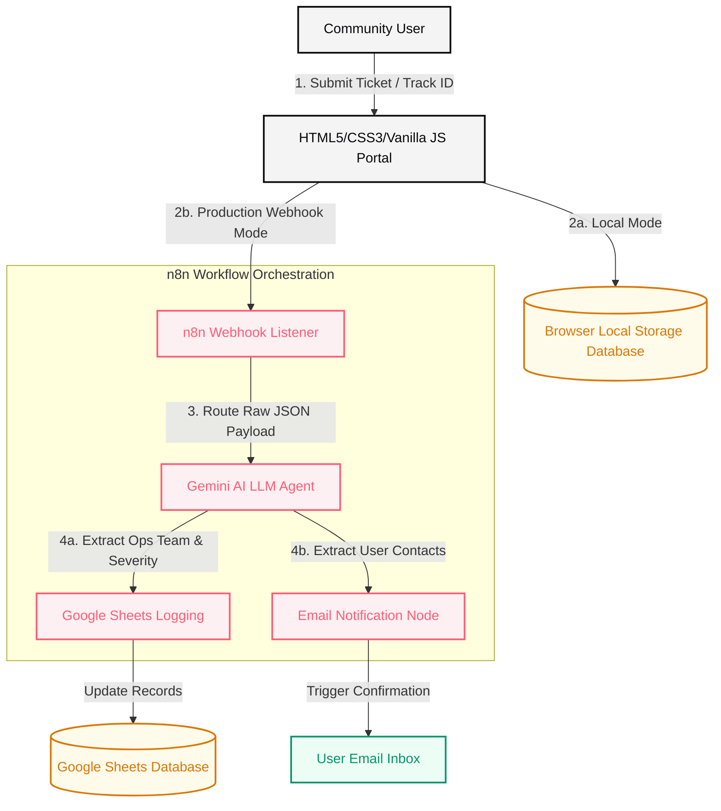

# System Architecture Document

This document outlines the architectural design of **Smart Civic AI**, illustrating the current static frontend layout and the future integration workflow powered by **n8n**, **Gemini AI**, **Google Sheets**, and notification triggers.

---

## 🏗️ System Overview

The system is designed with a **decoupled architecture**, strictly separating the presentation layer (frontend pages) from the data persistence and routing layer (backend).

Currently, data is processed locally in the client browser using simulated databases. However, the data contracts and wrapper JS functions are structured to support a transition to a serverless backend workflow once the API mode is toggled.



---

## 💻 1. Presentation Layer (Frontend)

The frontend is built using standard web languages and is designed for static hosting.

### Key Components:
- **`index.html` (Landing Page)**: General project descriptions, UN SDG 11 metrics and main CTA links.
- **`pages/report.html` (Form)**: Handles user input validation, GPS coordinate retrieval (using the Geolocation API), and image parsing to Base64.
- **`pages/track.html` (Tracker)**: Searches complaint records and displays progress on an interactive visual timeline.
- **`js/utils.js` (API Gateway)**: An abstraction layer that routes data calls. Pages query `API.submitComplaint()` and `API.getComplaint()` without knowing if the data is stored in `localStorage` or sent to a webhook.

---

## 🤖 2. Future Backend Orchestration Layer (n8n Workflow)

The production backend will utilize **n8n**, a node-based workflow automation tool, serving as the central orchestration engine. This eliminates the need to write and maintain complex Node.js or Express.js server runtimes.

### n8n Integration Pipeline:
1. **HTTP Webhook Node**:
   - Listens for incoming `POST` requests from the frontend at a custom URL.
   - Parses the JSON payload (title, description, location coordinates, and Base64 evidence image).
   - Generates a unique tracking reference (e.g., `SCAI-2026-XXXX`).

2. **Gemini AI Agent Node**:
   - Receives the issue description and title.
   - Instructed with a system prompt to act as an **Intelligent Operations Router**.
   - **Triage Action**: Evaluates the text to classify it into one of the predefined categories (waste, road, water, streetlight, safety) and routes it to the matching operations team (e.g., Waste Management Team, Infrastructure Team).
   - **Severity Rating**: Evaluates safety hazards to assign a severity rating (`High`, `Medium`, or `Low`).

3. **Google Sheets Database Node**:
   - Serves as the central logging database.
   - The n8n workflow appends a new row to a Google Sheet with fields: `ID`, `Date`, `Title`, `Category`, `Severity`, `Team`, `Coordinates`, `Image URL/Drive ID`, and `Status (Submitted)`.

4. **Email / SMS Notification Nodes**:
   - Triggers an email receipt (via SendGrid, Gmail, or SMTP nodes) to the user, containing their tracking code and a direct link to the progress page: `https://yourdomain.com/pages/track.html?id=SCAI-2026-XXXX`.

---

## 📊 3. Data Schema

The JSON payload structure exchanged between the frontend and backend is defined below.

### Issue Submission Payload (`POST /webhook`)
```json
{
  "title": "Clogged storm drain on Main Street",
  "category": "water",
  "description": "The storm drain at the intersection of Main Street and 4th Avenue is completely blocked with leaves and plastic bottles. Water is pooling on the street.",
  "location": "Main St & 4th Ave Intersection",
  "latitude": "12.971598",
  "longitude": "77.594562",
  "image": "data:image/png;base64,iVBORw0KGgoAAA..."
}
```

### Response Receipt Payload (`JSON`)
```json
{
  "id": "SCAI-2026-7782",
  "title": "Clogged storm drain on Main Street",
  "category": "water",
  "department": "Water Services",
  "priority": "High",
  "location": "Main St & 4th Ave Intersection",
  "latitude": "12.971598",
  "longitude": "77.594562",
  "status": "submitted",
  "aiSummary": "Blockage identified in main pipeline. Assigned to Water Services team.",
  "createdAt": "2026-07-20T17:47:28.000Z",
  "statusTimeline": [
    {
      "status": "submitted",
      "date": "2026-07-20T17:47:28.000Z",
      "note": "Report submitted via Webhook."
    },
    {
      "status": "review",
      "date": "2026-07-20T17:47:30.000Z",
      "note": "AI Triaged Category: WATER. Routed to Water Services."
    }
  ]
}
```
